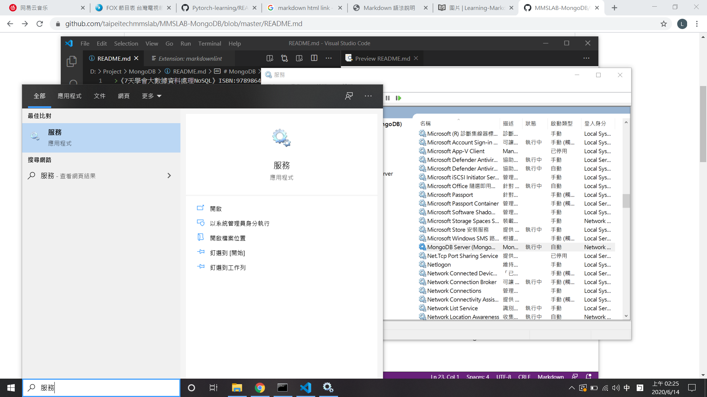

>《7天學會大數據資料處理NoSQL》ISBN:9789864343942
<https://github.com/taipeitechmmslab/MMSLAB-MongoDB>

<span id="contents"> </span>
MongoDB
====
<a href="#contents">

Contents
* [2.4 檢查與啟動MongoDB服務](#contents)
* [3.3 基本操作](#3_3)
* [5,6 更種操作，包含批次操作](#ch6)
* [7. 索引與效能分析](#ch7)
* [8. 聚合與管線](#ch8)
* [9. 備份複製](#ch9)
* [10. 實作會員系統的Web API](#ch10)


### 2.4 檢查與啟動MongoDB服務
1. 方法1：使用Windows Service啟動MongoDB服務
安裝MongoDB至Service，首先使用管理員開啟cmd：
```shell
mongod --config "D:\Program_Files\MongoDB\Server\4.2\bin\mongod.cfg" -install
'''
其實在安裝MongoDB過程中已經安裝了一個MongoDB服務，
我們只需要檢查電腦上的MongoDB服務狀態，
上述指令是教你如何新增服務至Windows Service
"mongod.cfg"為設定檔，裡面設定了資料儲存位置、日誌紀錄位置與網路設定。"
'''
#----啟動/停止
net start mongodb #啟動
net stop mongodb #停止

#----移除Windows Service服務(在安裝好服務後執行)
mongod --remove
```

在查詢欄位輸入「服務」，確認MongoDB服務狀態，用滑鼠點擊視窗來啟動/停止服務。


<span id="3_3"></span>
### 3.3 基本操作
要操作資料庫都要先進入mongo shell，在cmd裡輸入`mongo`
```shell
show dbs #可顯示目前所有的資料庫
use ntut #使用ntut的資料庫
db #檢查目前使用的資料庫名稱
db.students.insert({}) #在以students集合插入一筆空資料
show collections #可檢查db內的集合數量
db.students.count() #可檢查db資料庫內students集合的數量
#---刪除
db.dropDatabase() #刪除目前的資料庫
db.students.drop() #刪除以students的集合
```
表3-1 官方提供的`cmd`執行列表
|指令|用途說明|
|---|---|
|mongo|開啟操作shell|
|mongostat|顯示目前運行的MongoDB資料庫每一秒的狀態，可以加上參數來每幾秒運行一次|
|mongotop|顯示目前運行的MongoDB資料庫的每一個集合(collection)每一秒的執行操作花費時間|
|mongodump|輸出二進制的資料庫內容檔案，以進行資料備份|
|mongorestore|讀取二進制的資料庫內容檔案，進行資料還原|

<span id="ch6"></span>
### 5.1, 6.1 資料庫基本操作
#### 查詢運算子
◎關聯式資料庫
```SQL
SELECT 書本名稱, 價錢
FROM library
WHERE 借閱人="王小明"
```
◎MongoDB
```json
db.library.find({借閱人:"王小明"}, {書本名稱:true, 價錢:true})
```
#### 插入操作
◎關聯式資料庫
```sql
INSERT INTO 書籍借閱紀錄 (編號, 書本名稱, 價錢, 借閱人, 借閱時間)
VALUE (4, "超人氣銅板美食", 250, "小華", "2015/7/30 22:30")
```
◎MongoDB
```json
db.書籍借閱紀錄.insert({
    編號:4,
    書本名稱:"超人氣銅板美食",
    價錢:250,
    借閱人:"小華",
    借閱時間:ISODate("2015-07-30T22:30:30:00Z")
})
```
#### 更新操作
◎關聯式資料庫
```sql
UPDATE library
SET 借閱人="王大陸"
WHERE 書本名稱="實用英文會話"
```
◎MongoDB
```json
db.library.update({書本名稱:"實用英文會話"}, {$set:{借閱人:"王大陸"}})
```
#### 刪除操作
◎關聯式資料庫
```sql
DELETE
FROM library
WHERE 借閱人="阿能"
```
◎MongoDB
```json
db.library.remove({借閱人:"阿能"})
```
#### 6.5 批次操作(Bulk Write Operation)
將資料操作用一個數組包含起來一次執行：
```shell
db.collection.bulkWrite(
    [<operation 1>, <operation2>, ...],
    {
        writeConcern : <document>,
        ordered : <boolean>
    }
)
```
|參數|型態|描述|
|---|---|---|
[operations](https://docs.mongodb.com/manual/core/bulk-write-operations/#bulkwrite-methods)|數組array|一組批次操作，常見的操作有insertOne, updateOne, ...。
[writeConcern](https://docs.mongodb.com/manual/reference/write-concern/)|文件document|(可選的)操作要求回應設定{w:<value>, j:<boolean>, wtimeout:<number>}。預設w:1為操作確實完成後回應，w:0不要求操作確實完成，除非是連線有問題才會出錯。j:true，資料要確實寫入到磁碟內，但在沒有開啟Journal的MongoDB伺服器會出錯。wtimeout如果操作花費的時間超過指定的數值就會出錯，不論操作是否成功的執行，單位為millisecond，且只有在w >= 1時會作用。
ordered|布林值boolean|批次操作是否需要依序執行，預設值為true。
```json
//範例資料在https://github.com/taipeitechmmslab/MMSLAB-MongoDB/tree/master/Ch-6
db.getCollection('drink').bulkWrite(
    [
        {
            updateOne:{
                filter:{_id:"001"},
                update:{$inc:{sold:20},$push:{log:{time:Date.now(),size:"M"}}}
            }
        },
        {
            updateOne:{
                filter:{_id:"002"},
                update:{$inc:{sold:40},$push:{log:{time:Date.now(),size:"M"}}}
            }
        },
        {
            updateOne:{
                filter:{_id:"003"},
                update:{$inc:{sold:65},$push:{log:{time:Date.now(),size:"L"}}}
            }
        },
    ]
)
```
<span id="ch7"></span>
### 7. 索引與效能分析

#### 7.1.1 索引(Indexes)
MongoDB在查詢資料時，會做兩個動作，分別為遍歷或掃描(Scan)、取得資料(Retrieve)；遍歷的動作是非常耗時的，因此在資料量非常攏大的時候，將資料對特定條件設定索引(Indexs)，來限制遍歷資料的數量，並減少了取得資料的時間，因此能增快查詢的效率。在新增索引的同時也可對鍵值或屬性(Key)進行相關(Value)的排序，因此增快了搜索效率。MongoDB提供了六種[索引方法](https://docs.mongodb.com/manual/indexes/)：

1. [單一欄位(Single Field)](https://docs.mongodb.com/manual/core/index-single/)
2. [組合索引(Compound Indexes)](https://docs.mongodb.com/manual/core/index-compound/)
3. [文字索引(Text Indexes)](https://docs.mongodb.com/manual/core/index-text/)
4. [多重鍵值索引(Multikey Indexes)](https://docs.mongodb.com/manual/core/index-multikey/)
5. [地理空間索引(Geospatial Indexes)](https://docs.mongodb.com/manual/core/2dsphere/)
6. [雜湊索引(Hashed Indexes)](https://docs.mongodb.com/manual/core/index-hashed/)
```json
// 建立單一欄位索引
db.students.createIndex({score:1})
//=== 執行搜索操作
db.students.find(
    {score:{ $gte:50, $lte:80 }}
) //搜索students集合score大於等於50，小於等於80
//此指令需要切換到"db.system.profile"集合內找尋紀錄

db.students.find(
    {score:{ $gte:50, $lte:80 }}
).explain("executionStats")
//直接將執行記錄寫在搜尋結果(bson object)，該記錄寫在建立類別"executionStats"裡
```
透過`db.students.createIndex({score:1})`，在students集合建立一個score欄位<span style="background-color:yellow">遞增</span>排序的索引，而`db.students.createIndex({score:-1})`為<span style="background-color:yellow">遞減</span>排序索引。

#### 7.1.2 查詢計畫(Query Plan)
我們可以透過查詢計畫，來判斷目前的查詢是否有使用索引，以及在查詢時索引的使用效率。

■ 設定此資料的分析等級：
```json
db.setProfilingLevel(<#等級>)

db.setProfilingLevel(0) //不收集任何資訊
db.setProfilingLevel(1, {slowms: 20}) //大於20微秒
db.setProfilingLevel(2) //收集所有操作資訊

db.getProfilingStatus() //可查詢設定狀態
```
|等級|描述|
|---|---|
|0|預設等級，不收集任何資料|
|1|收集操作的時間大於slowms|
|2|收集所有資料|

■ 查詢結果
在collections目錄上按右鍵選擇`Refresh`來更新集合；當出現`system.profile`集合，代表db.setProfilingLevel(2)操作成功。

<span id="ch8"></span>
### 8. 聚合(Aggregate)與管線(Pipeline)
聚合可使我們能夠針對資料作一系列的pipeline，類似流程的概念，對資料做有序性的處理；其中pipeline可以對資料進行後製處理，例如資料加總、平均等。在聚合內的參數由一數組包含pipeline與參數來控制，更多[聚合操作參考](https://docs.mongodb.com/manual/aggregation/)。而Map-Reduce是支援JavaScript的操作。
```shell
db.collection.aggregate(
    [<pipeline 1>, <pipeline 2>, ...] #pipeline數組
    {<options>}
)
'''
可使用的<pipeline>包含$match, $group, $project, $limit, $skip, $geoNear, $lookup等。
'''

db.getCollection('customers').aggregate([
    {$match:{city:"台北市"}}, #對集合內的資料進行篩選處理
    {$group:{_id:"$district",ages:{$push:"$age"}}}, #看後面註解
    {$project:{_id:1,value:{$sum:"$ages"}}}, #針對欄位進行計算後，重新輸出(project)到某個欄位
    {$out:"taipei_city"} #輸出到taipei_city集合
])
```
在\$group pipeline中，用「_id」欄位作為分組規則，判斷資料的district欄位值是否要被分在同一組，分在同一組的資料的age值利用$push儲存到ages陣列的最後一個。

如果要使用當前被處理資料的欄位數值，可以透過加上「$」符號並使用雙引號「"」，進行遍數變換。[p.215]

如果在\$group將「_id」欄位設為固定值(例如：1)，則所有經過處理的資料皆視為同一組。使用"$$ROOT"為[變數](https://docs.mongodb.com/manual/reference/aggregation-variables/)，為輸入在進入pipeline前的原始資料。

<span id="ch9"></span>
### 9. 備份複製(Replication)
透過設定`mongod`的運行組態`--replSet "分組名稱"`，來決定是否啟動Replica Set的功能。例如：我們透過命令提示字元輸入mongod --replSet "rs0"，啟動資料庫的Replica Set功能，並設定此資料庫的複製分組為rs0。
```shell
# 這是一個cmd視窗
mkdir "d:\local_replSet\db{1-3}"
mongod --replSet rs0 --port 27017 --dbpath "D:\local_rep\db1"
# 第二個cmd視窗
mongod --replSet rs0 --port 27018 --dbpath "D:\local_rep\db2"
# 第三個cmd視窗
mongod --replSet rs0 --port 27019 --dbpath "D:\local_rep\db3"
```
注意MongoDB預設的連接埠是27017，可在`mongod.conf`組態檔觀察各設定參數[p.34, p.232]，[組態檔設定參考](https://docs.mongodb.com/manual/reference/configuration-options/)。

```shell
# 開啟一個全新的cmd，連接其中一個mongod資料庫
mongo #使用mongo管理工具連接到port為27017的mongod
# rs.initiate() 或是
rs.initiate({_id:"rs0",members:[{_id:0,host:"localhost:27017"}]})
#查詢目前的MongoDB Replica Set狀態與設定
rs.status()
#---新增Replica Set成員
rs.add({_id:1,host:"localhost:27018"})
rs.add({_id:2,host:"localhost:27019"})
rs.status() #觀察連接狀況

rs.remove("localhost:27018") #移除成員
"""
延伸使用，透過mongo指令連線，同時連線三個Replica Set
資料庫，需再增加連線參數
也能在電腦新增三個mongod.conf組態檔，加入Replica Set
資料庫，並透過服務啟動MongoDB，取代cmd的啟動方式
"""
mongo --host rs0/localhost:27017,localhost:27018,localhost:27019
#上述命令即使沒有輸入全部成員的連線資訊，mongo工具偵測到其他成員時，會自動新增連線資訊
#---監測資料
mongostat --host rs0/localhost:27017,localhost:27018,localhost:27019
```
注意所有的設定操作只能在primary成員執行，如果發現目前的指令無法執行，則需要連線到primary的資料庫；[詳細的狀態欄位資訊的介紹](https://docs.mongodb.com/manual/reference/command/replSetGetStatus/#dbcmd.replSetGetStatus)。

當發生[error in using rs.initiate() in mongo](https://stackoverflow.com/questions/41295767/error-in-using-rs-initiate-in-mongo/52971267)，就在連接primary的mongo的命令輸入`db.adminCommand( { shutdown : 1} )`然後再重新`rs.initiate()`就行了。

■ 將Secondary成員提升為Primary成員
```shell
#假設重新開啟一個cmd要重連mongo工具
mongo --host rs0/localhost:27017,localhost:27018,localhost:27019
cfg = rs.conf()
#mongo工具是一個JavaScript的互動介面，透過rs.conf()取得目前的組態設定，並儲存在cfg變數

cgf.members[0].priority= 0.5
cgf.members[1].priority= 0.5
cgf.members[2].priority= 1
rs.reconfig(cfg)
rs.status()
```
<span id="ch10"></span>
### 10. 實作會員系統的Web API

<div align=center>表10.1 會員系統Web API</div>

|HTTP URL|HTTP Method|指令說明|
|---|---|---|
http://localhost/api/member/|POST|發送資料，用POST請求通常會改變伺服器的某一筆資料或狀態
http://localhost/api/member/|PUT|取代資料，用PUT請求通常將附帶的資料取代伺服器的某一筆資料
http://localhost/api/member/<會員編號>|DELETE|用來請求伺服器刪除某一筆資料
http://localhost/api/member/|GET|只用來取得數據

HTTP連線就是用不同的要求(Request)方法來區分不同的回應(Response)動作，來控制服務端與客戶端之間的操作。

<div align=center>表10.2 ASP.NET專案目錄</div>

|資料夾|說明|
|---|---|
Properties|放屬性資訊的資料夾，如組態資訊(AssemblyInfo.cs)
App_Data|放應用程式的資料夾，包含.mfd資料庫檔、XML檔案或其他類型的資料儲存檔案
App_Start|放設定檔的資料夾，WebApiConfig.cs適用於Web API，它可設定Web-API-specific路由，及一個HTTP請求發送給Web服務器時，要將此HTTP請求轉交給某一個Controller處理。在Web API 2中，我們使用路由屬性(Route Attributes)來將某個HTTP請求轉交給某一個控制器。
Controllers|放控制器的資料夾
Models|放模型的資料夾

<div align=center>表10.3 ASP.NET專案的檔案</div>

|檔名|說明|
|---|---|
Global.asax|此檔案繼承了ASP.NET應用程式中所有應用程式物件通用方法、屬性和事件。在Web API專案的用途為根據WebApiComfig.cs的內容，設定ASP.NET應用程式參數，讓IIS知道如何使用Web API專案
packages.config|設定專案所參考的套件清單。在切換不同電腦時，讓NuGet工具下載參考的套件清單，還原專案的相依性
Web.config|用於切換Web API專案發行時，針對不同的版本進行相關參數設定。例如：發行除錯(Debug)版本時，設定MongoDB的連線字串為本地的資料庫；在發行線上版(Online)時，設定MongoDB的連線字串為線上服務的資料庫。

在NuGet管理器下載完MongoDB.Driver之後，會更新專案中的`packages.config`檔案，使得未來專案在不同電腦上執行時，能夠自動下載套件，還原專案的相依性：[p.267]

